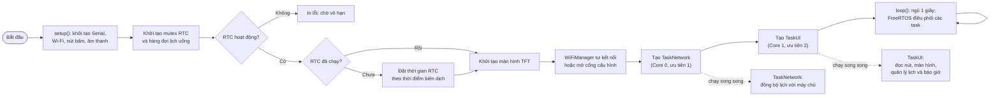
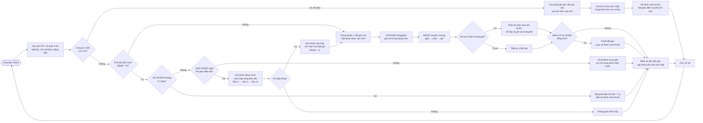
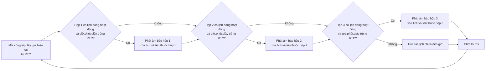
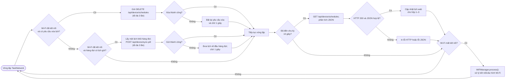

# Lưu đồ thuật toán — Button_Nhung_2026

Các sơ đồ dưới đây được đọc từ [`Button_Nhung_2026.ino`](./Button_Nhung_2026.ino). Mỗi sơ đồ là một khối riêng và đi theo chiều ngang từ trái sang phải.

## 1. Khởi động và kiến trúc chương trình

## 2. TaskUI — chọn thuốc và đặt giờ uống

## 3. TaskUI — kiểm tra giờ và phát báo thuốc

## 4. TaskNetwork — đồng bộ hai chiều với máy chủ

**Ghi chú:** Lịch được kích hoạt khi thời gian hộp khớp chính xác với giờ, phút và giây RTC; đây là phép so khớp thời điểm, không phải bộ đếm ngược. Lịch local được gửi qua hàng đợi FreeRTOS; lịch tải từ máy chủ được cập nhật vào các hộp tương ứng.
