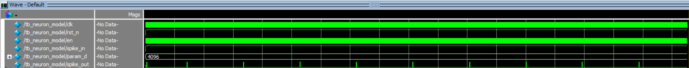
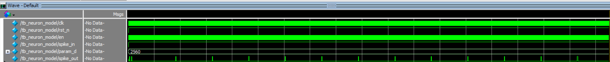
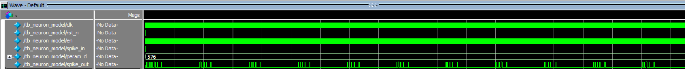
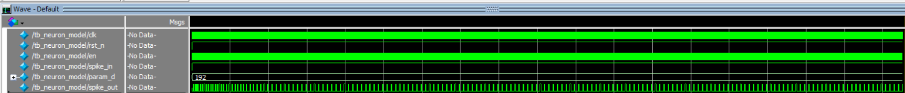
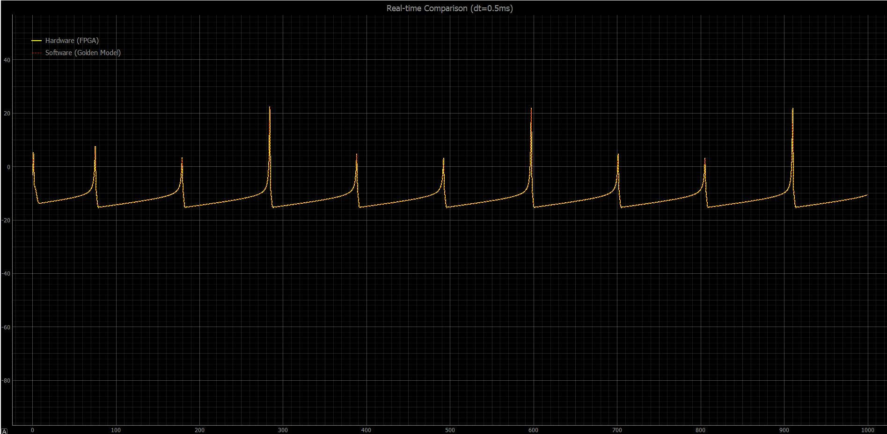
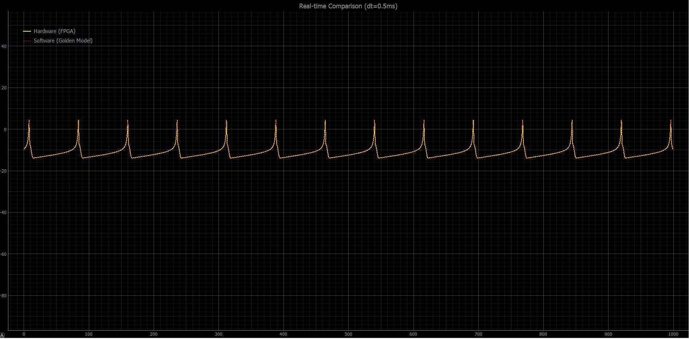
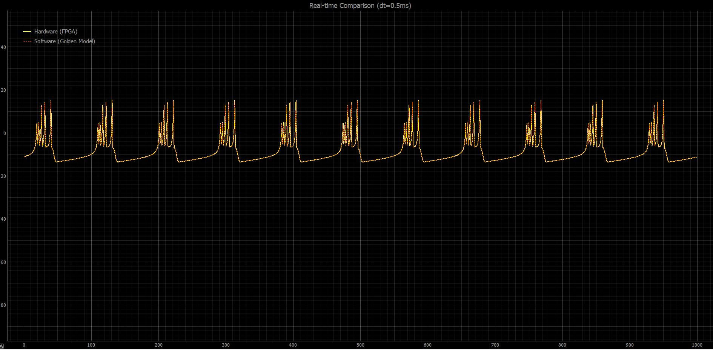
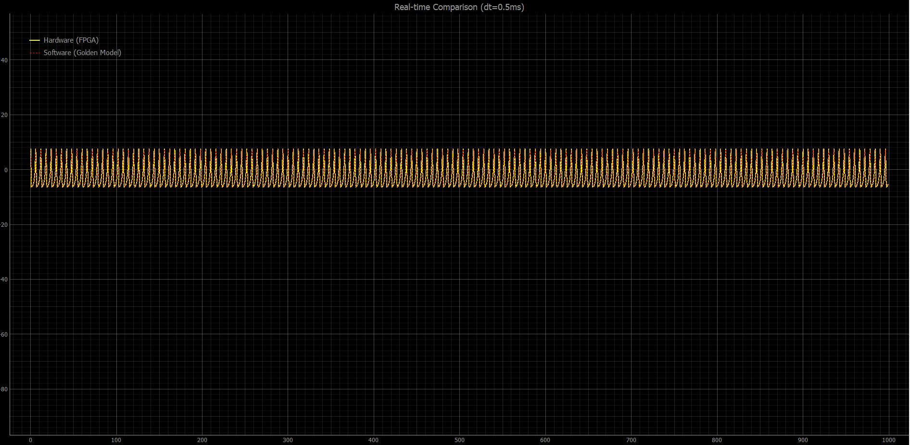

## Mục lục

* [PHẦN 1: Cấu trúc hệ thống phần cứng (FPGA Gowin Kiwi 1p5)](#phần-1-cấu-trúc-hệ-thống-phần-cứng-fpga-gowin-kiwi-1p5)

  * [Giao thức UART 4-Bytes](#giao-thức-uart-4-bytes)
  * [Cơ chế cập nhật tham số](#cơ-chế-cập-nhật-tham-số)
  * [Pinout (FPGA Gowin Kiwi 1p5)](#pinout-fpga-gowin-kiwi-1p5)


* [PHẦN 2: Giao tiếp phía PC](#giao-tiếp-phía-pc-python)
  
  * [Giao diện hiển thị](#giao-diện-hiển-thị)
  * [Hướng dẫn chạy](#hướng-dẫn-chạy)

* [PHẦN 3: Kết quả chạy](#kết-quả-chạy)

  * [A) ModelSim](#a-modelsim)

     * [A.1 Regular Spiking (RS)](#a1-regular-spiking-rs)
     * [A.2 Intrinsically Bursting (IB)](#a2-intrinsically-bursting-ib)
     * [A.3 Chattering](#a3-chattering)
     * [A.4 Low Threshold Spiking (LTS)](#a4-low-threshold-spiking-lts)

  * [B) Python (Real-time Hardware)](#b-python-real-time-hardware)

     * [B.1 Regular Spiking (RS)](#b1-regular-spiking-rs)
     * [B.2 Intrinsically Bursting (IB)](#b2-intrinsically-bursting-ib)
     * [B.3 Chattering](#b3-chattering)
     * [B.4 Low Threshold Spiking (LTS)](#b4-low-threshold-spiking-lts)

## Cấu trúc Project

```
1_neuron_gowin_2/
│
├── 1_neuron_gowin.cr.mti # Gowin project config/meta
├── 1_neuron_gowin.gprj # Main Gowin project file
├── 1_neuron_gowin.gprj.user # User-specific settings
├── 1_neuron_gowin.mpf # FPGA pin/I/O constraints
│
├── hw_v_out.txt # Simulation output data
├── plot_tb.py # Plot results from testbench
├── python_test*.py # Python experiment scripts
├── test_trunc.py # Data truncation test
│
├── sim.do # ModelSim/Questa simulation script
├── tb_neuron.v # Neuron testbench
├── tb_shift.v # Shift module/testbench
├── vsim.wlf # Simulation waveform file
│
├── impl/ # Implementation results
│ ├── 1_neuron_gowin_process_config.json
│ │
│ ├── gwsynthesis/ # Synthesis outputs
│ │ ├── *.log
│ │ ├── *.vg
│ │ ├── *_syn.rpt.html
│ │ └── *_resource.html
│ │
│ └── pnr/ # Place & Route outputs
│ ├── *.binx # Bitstream
│ ├── *.fs
│ ├── *.log
│ ├── .rpt.
│ ├── *.timing_paths
│ ├── .tr.html
│ └── device.cfg
│
├── scratch/ # Experimental scripts
│ ├── max_min.py
│ ├── print_vals.py
│ └── test_mul.py
│
└── src/ # Source code
├── 1_neuron_gowin.cst # Constraints
├── 1_neuron_gowin.sdc # Timing constraints
├── button_debouncer.v
├── mul16s_HF7.v.v
├── neuron_model.v # Main neuron module
├── regfile.v
├── UART_RX.v
├── uart_top.v
└── uart_tx.v
```

## PHẦN 1: Cấu trúc hệ thống phần cứng (FPGA Gowin Kiwi 1p5)

### Pinout & Phần cứng

| Tín hiệu    | Pin | IO Type  | Pull Mode | Drive | Điện áp | Mô tả               |
| ----------- | --- | -------- | --------- | ----- | ------- | ------------------- |
| `clk`       | 4   | LVCMOS33 | UP        | —     | 3.3V    | Clock hệ thống      |
| `rst_n`     | 35  | LVCMOS33 | UP        | —     | 3.3V    | Reset (active low)  |
| `S1`        | 36  | LVCMOS33 | UP        | —     | 3.3V    | Nút nhấn người dùng |
| `rx_serial` | 33  | LVCMOS33 | NONE      | —     | 3.3V    | UART RX (PC → FPGA) |
| `tx_serial` | 34  | LVCMOS33 | NONE      | 8     | 3.3V    | UART TX (FPGA → PC) |


### Giao thức UART 4-Bytes

Hệ thống sử dụng giao thức UART để truyền dữ liệu thời gian thực giữa FPGA và máy tính.
Mỗi chu kỳ truyền, dữ liệu được đóng gói thành một gói **32-bit (4 bytes)** gồm:

* **2 bytes cao**: tham số phục hồi `D`
* **2 bytes thấp**: điện thế màng `V`

Trong file `uart_top.v`, FSM thực hiện đóng gói dữ liệu:

```verilog
CAPTURE: begin
    // Đóng gói 4 bytes: [D_high][D_low][V_high][V_low]
    tx_packet <= {current_d_from_rf, v_monitor};
    state     <= TX_RESULT;
end
```

Cách đóng gói này giúp phía PC luôn biết trạng thái neuron (`V`) tương ứng với tham số (`D`) mà không cần truy vấn thêm.

---

### Cơ chế cập nhật tham số

Hệ thống hỗ trợ hai cách thay đổi tham số `D`:

1. **Từ PC qua UART (ưu tiên cao nhất)**
2. **Thông qua nút nhấn trên board**

```verilog
// ƯU TIÊN 1: UART
if (uart_we) begin
    reg_d   <= uart_wdata;
    btn_idx <= 2'd0; 
end 
// ƯU TIÊN 2: Button
else if (btn_tick) begin
    if (btn_idx == 2'd0) begin
        btn_idx <= 2'd1;
        reg_d   <= 16'sd576;
    end
    // ...
end
```

Cơ chế này cho phép chuyển đổi linh hoạt giữa điều khiển bằng phần mềm và phần cứng.

---

## PHẦN 2: Giao tiếp phía PC

```python
# Gửi tín hiệu đầu vào
ser.write(bytes([s_in]))

# Đọc 4 bytes từ UART
raw_bytes = ser.read(4)

if len(raw_bytes) == 4:
    # Giải mã: 2 số int16 có dấu (Little Endian)
    v_int, hw_d = struct.unpack('<hh', raw_bytes)

    hw_results.append(v_int / SCALE_FACTOR)

    # Đồng bộ tham số D từ phần cứng
    sw_neuron.D = hw_d
```

* `V` được scale về giá trị thực
* `D` từ FPGA được đồng bộ trực tiếp vào mô hình phần mềm

---

### Giao diện hiển thị

* Sử dụng **PyQt5** để xây dựng GUI
* Sử dụng **pyqtgraph** để hiển thị đồ thị thời gian thực

---

### Hướng dẫn chạy

- [Gowin EDA](https://www.gowinsemi.com/en/support/download_eda/) (Synthesize + Place & Route)
- [Gowin Programmer](https://www.gowinsemi.com/en/support/download_eda/) (Nạp bitstream)
- [Python 3](https://www.python.org/) + [pyserial](https://pypi.org/project/pyserial/) (Testing)

```bash
python python_test_4.py
```

Sau khi chạy:

* FPGA gửi dữ liệu neuron qua UART
* Python nhận và xử lý
* GUI hiển thị tín hiệu theo thời gian thực


## PHẦN 3: Kết quả chạy

Hệ thống được kiểm chứng trên cả môi trường mô phỏng và thực nghiệm.
Các chế độ neuron được đánh giá bao gồm: RS, IB, Chattering và LTS.

---

### A) ModelSim

Kết quả mô phỏng được thực hiện bằng ModelSim thông qua testbench của module `neuron_model`.

#### A.1 Regular Spiking (RS)

* Spike xuất hiện đều theo thời gian
* Khoảng cách giữa các spike ổn định

  

---

#### A.2 Intrinsically Bursting (IB)

* Xuất hiện các cụm spike (burst)
* Có khoảng nghỉ giữa các cụm

  

---

#### A.3 Chattering

* Burst với mật độ spike cao
* Các cụm spike dày và liên tục

  

---

#### A.4 Low Threshold Spiking (LTS)

* Dễ phát xung với kích thích nhỏ
* Khoảng nghỉ giữa các spike hẹp

  

---

### B) Python (Real-time Hardware)

Kết quả thực nghiệm được thu từ FPGA thông qua UART và hiển thị bằng Python (PyQt5 + pyqtgraph).

#### B.1 Regular Spiking (RS)

* Tín hiệu ổn định, dạng spike đều
* Khớp với mô phỏng ModelSim



---

#### B.2 Intrinsically Bursting (IB)

* Burst rõ ràng, có chu kỳ
* Biên độ và dạng sóng tương đồng mô phỏng
* Khớp với mô phỏng ModelSim



---

#### B.3 Chattering

* Tần số cao, spike dày
* Phản ánh đúng đặc tính neuron nhanh
* Khớp với mô phỏng ModelSim
  


---

#### B.4 Low Threshold Spiking (LTS)

* Phát xung ngay cả khi kích thích yếu
* Dạng sóng nhạy hơn RS
* Khớp với mô phỏng ModelSim



---

### Nhận xét tổng thể

* Kết quả ModelSim và phần cứng thực tế có độ tương đồng cao
* Hệ thống hoạt động ổn định ở thời gian thực
* Giao thức UART đảm bảo truyền dữ liệu chính xác và liên tục


