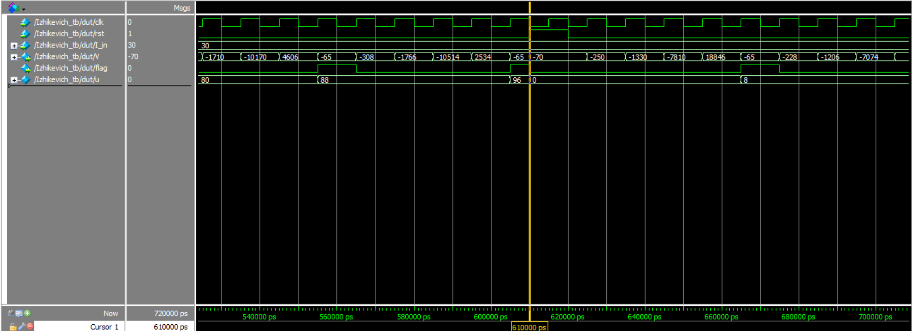

<h2>PHẦN 1 : File Breakout trong framework BinsdNET</h2>

<h3>STDP <Spike-Timing-Dependent Plasticity> : Là 1 quy tắc học tập sinh học trong mạng neuron. Nó nói rằng không chỉ việc 2 neuron bắn xung quang trọng mà còn quan trọng ai bắn trước, ai bắn sau.</h3>

* (Bạn có thể tìm hiểu thêm tại đây : https://florian.io/papers/2007_Florian_Modulated_STDP.pdf)
  
* File "breakout.py" và file "breakout.py" đều dựa vào framework BindsNET khởi tạo mạng SNN cho game BreakoutDeterministic. 

<h3>Tuy nhiên ở file "breakout.py", phần khỏi tạo liên kết giữa các lớp :</h3>

``` python 
    inpt_middle = Connection(source=inpt, target=middle, wmin=0, wmax=1)
    python middle_out = Connection(source=middle, target=out, wmin=0, wmax=1)
```
&rarr; Không có quy tắc học (update_rule) cụ thể nên các trọng số không thay đổi trong quá trình mô phỏng.

<h3>Còn ở file "breakout_stdp.py" :</h3>

``` python
    inpt_middle = Connection(source=inpt, target=middle, wmin=0, wmax=1e-1)
    middle_out = Connection(
        source=middle,
        target=out,
        wmin=0,
        wmax=1,
        update_rule=MSTDP,
        nu=1e-1,
        norm=0.5 * middle.n,
    )
```
&rarr; Có quy tắc học theo MSTDP (MTSDP là quy tắc học quy tắc học dựa vào thời gian phát xung giữa neuron tiền-synapse và hậu-synapse).

<h4>&Longrightarrow; Trọng số synapse thay đổi theo thời gian, sau nhiều vòng chơi hiệu suất được cải thiện. Việc sử dụng MSTDP đang mô phỏng mô hình Reinforcement Learning 1 cách sinh học trong não bộ.</h4>


<h3>Pipeline BindsNET : Là khung cho việc mô phỏng và huấn luyện mạng SNN của BinsdNET</h3>

``` python
environment_pipeline = EnvironmentPipeline(
    network,
    environment,
    encoding=bernoulli,
    action_function=select_softmax,
    output="Output Layer",
)
```
* network : Mạng đã xây dựng.
* environment : Môi trường trò chơi.
* encoding : Mã hóa dữ liệu đầu vào theo phân phối chuẩn Bernoulli.
* action_functionn : Chọn một hành động bằng cách sử dụng hàm softmax dựa trên số lượng spike (xung) phát ra từ một lớp trong mạng.

<h2>Phần 2 : Izhikevich Verilog</h2>

<h3> Design Code : </h3>

```verilog
module Izhikevich (
	input clk,
	input rst,
	input signed [15:0] I_in,   			   // Input current
	output reg signed [15:0] V, 			   // Membrane potential
	output reg flag                            // Save the spike
);

	parameter signed [15:0] a = 16'sd2;   		// Recovery time scale 
	parameter signed [15:0] b = 16'sd2;   		// Sensitivity of u
	parameter signed [15:0] c = -16'sd65; 		// Reset value for v
	parameter signed [15:0] d = 16'sd8;   		// Reset increment for u
	parameter signed [15:0] V_peak = 16'sd30;		//Threshold
	
	reg signed [15:0] u; 				// Recovery variable
	
	always @(posedge clk or posedge rst) begin
		if (rst) begin
		flag <= 1'b0;
			V <= -16'sd70; 
			u <= 16'sd0;   
		end 
	else begin
			if (V >= V_peak) begin
		flag <= 1'b1;
				V <= c;          
				u <= u + d;         
			end 
		else begin
				flag <= 1'b0;
				V <= V + ((16'sd4 / 16'sd100) * V * V) + 16'sd5 * V + 16'sd140 - u + I_in;
				u <= u + (a / 16'sd100) * ((b / 16'sd10) * V - u);
			end
		end
	end
endmodule
```

<h3> Testbench Code :</h3>

```verilog
`timescale 1ns/1ps

module Izhikevich_tb;
	reg clk;
	reg rst;
	reg signed [15:0] I_in;
	wire signed [15:0] V;
	wire flag;
	
	Izhikevich dut (
		.clk(clk),
		.rst(rst),
		.I_in(I_in),
		.V(V),
		.flag(flag)
	);

	always #5 clk = ~clk; 
	
	initial begin

		clk = 0;
		rst = 1;
		I_in = 0;
	
		#10 rst = 0;
		
		// Test case with I_in small
		I_in = 16'sd10;
		#300;
	
		// Test case with I_In bigger
		I_in = 16'sd30;
		#300;
	
		// Test case with reset rst during the run
		rst = 1;
		#10 rst = 0;
	
		#100;
	
		$stop;
		end

	initial begin
		$monitor($time, " Reset=%b, I_in=%d, v=%d, Flag=%b", 
				 rst, I_in, $signed (V), flag);
	end
	
endmodule
```

<h3> Simulation</h3>

<h4> * Transcript :</h4>

```
#					0  Reset=1, I_in=     0, v=   -70, Flag=0
#                   10 Reset=0, I_in=    10, v=   -70, Flag=0
#                   15 Reset=0, I_in=    10, v=  -270, Flag=0
#                   25 Reset=0, I_in=    10, v= -1470, Flag=0
#                   35 Reset=0, I_in=    10, v= -8670, Flag=0
#                   45 Reset=0, I_in=    10, v= 13666, Flag=0
#                   55 Reset=0, I_in=    10, v=   -65, Flag=1
#                   65 Reset=0, I_in=    10, v=  -248, Flag=0
#                   75 Reset=0, I_in=    10, v= -1346, Flag=0
#                   85 Reset=0, I_in=    10, v= -7934, Flag=0
#                   95 Reset=0, I_in=    10, v= 18074, Flag=0
#                  105 Reset=0, I_in=    10, v=   -65, Flag=1
#                  115 Reset=0, I_in=    10, v=  -256, Flag=0
#                  125 Reset=0, I_in=    10, v= -1402, Flag=0
#                  135 Reset=0, I_in=    10, v= -8278, Flag=0
#                  145 Reset=0, I_in=    10, v= 16002, Flag=0
#                  155 Reset=0, I_in=    10, v=   -65, Flag=1
#                  165 Reset=0, I_in=    10, v=  -264, Flag=0
#                  175 Reset=0, I_in=    10, v= -1458, Flag=0
#                  185 Reset=0, I_in=    10, v= -8622, Flag=0
#                  195 Reset=0, I_in=    10, v= 13930, Flag=0
#                  205 Reset=0, I_in=    10, v=   -65, Flag=1
#                  215 Reset=0, I_in=    10, v=  -272, Flag=0
#                  225 Reset=0, I_in=    10, v= -1514, Flag=0
#                  235 Reset=0, I_in=    10, v= -8966, Flag=0
#                  245 Reset=0, I_in=    10, v= 11858, Flag=0
#                  255 Reset=0, I_in=    10, v=   -65, Flag=1
#                  265 Reset=0, I_in=    10, v=  -280, Flag=0
#                  275 Reset=0, I_in=    10, v= -1570, Flag=0
#                  285 Reset=0, I_in=    10, v= -9310, Flag=0
#                  295 Reset=0, I_in=    10, v=  9786, Flag=0
#                  305 Reset=0, I_in=    10, v=   -65, Flag=1
#                  310 Reset=0, I_in=    30, v=   -65, Flag=1
#                  315 Reset=0, I_in=    30, v=  -268, Flag=0
#                  325 Reset=0, I_in=    30, v= -1486, Flag=0
#                  335 Reset=0, I_in=    30, v= -8794, Flag=0
#                  345 Reset=0, I_in=    30, v= 12894, Flag=0
#                  355 Reset=0, I_in=    30, v=   -65, Flag=1
#                  365 Reset=0, I_in=    30, v=  -276, Flag=0
#                  375 Reset=0, I_in=    30, v= -1542, Flag=0
#                  385 Reset=0, I_in=    30, v= -9138, Flag=0
#                  395 Reset=0, I_in=    30, v= 10822, Flag=0
#                  405 Reset=0, I_in=    30, v=   -65, Flag=1
#                  415 Reset=0, I_in=    30, v=  -284, Flag=0
#                  425 Reset=0, I_in=    30, v= -1598, Flag=0
#                  435 Reset=0, I_in=    30, v= -9482, Flag=0
#                  445 Reset=0, I_in=    30, v=  8750, Flag=0
#                  455 Reset=0, I_in=    30, v=   -65, Flag=1
#                  465 Reset=0, I_in=    30, v=  -292, Flag=0
#                  475 Reset=0, I_in=    30, v= -1654, Flag=0
#                  485 Reset=0, I_in=    30, v= -9826, Flag=0
#                  495 Reset=0, I_in=    30, v=  6678, Flag=0
#                  505 Reset=0, I_in=    30, v=   -65, Flag=1
#                  515 Reset=0, I_in=    30, v=  -300, Flag=0
#                  525 Reset=0, I_in=    30, v= -1710, Flag=0
#                  535 Reset=0, I_in=    30, v=-10170, Flag=0
#                  545 Reset=0, I_in=    30, v=  4606, Flag=0
#                  555 Reset=0, I_in=    30, v=   -65, Flag=1
#                  565 Reset=0, I_in=    30, v=  -308, Flag=0
#                  575 Reset=0, I_in=    30, v= -1766, Flag=0
#                  585 Reset=0, I_in=    30, v=-10514, Flag=0
#                  595 Reset=0, I_in=    30, v=  2534, Flag=0
#                  605 Reset=0, I_in=    30, v=   -65, Flag=1
#                  610 Reset=1, I_in=    30, v=   -70, Flag=0
#                  620 Reset=0, I_in=    30, v=   -70, Flag=0
#                  625 Reset=0, I_in=    30, v=  -250, Flag=0
#                  635 Reset=0, I_in=    30, v= -1330, Flag=0
#                  645 Reset=0, I_in=    30, v= -7810, Flag=0
#                  655 Reset=0, I_in=    30, v= 18846, Flag=0
#                  665 Reset=0, I_in=    30, v=   -65, Flag=1
#                  675 Reset=0, I_in=    30, v=  -228, Flag=0
#                  685 Reset=0, I_in=    30, v= -1206, Flag=0
#                  695 Reset=0, I_in=    30, v= -7074, Flag=0
#                  705 Reset=0, I_in=    30, v= 23254, Flag=0
#                  715 Reset=0, I_in=    30, v=   -65, Flag=1
```

<h4> * Waveform:</h4>




